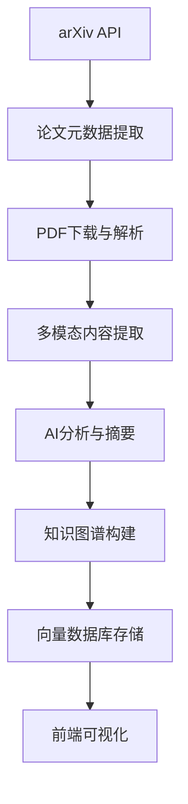

# 🌌 智能论文阅读宇宙 (Smart AI Paper Reader Universe)

一个基于AI的论文知识图谱系统，支持自动化论文抓取、智能分析和可视化探索。

## 🎯 项目概述

### 主要功能
- **📊 自动化论文抓取**: 每日自动获取arXiv最新AI论文
- **🧠 智能内容分析**: 使用LLM提取关键信息和生成摘要
- **🕸️ 知识图谱构建**: 基于引用关系构建论文网络
- **🔍 多模态RAG**: 支持文本和图像的语义搜索
- **🎨 可视化界面**: 交互式3D知识图谱浏览
- **💡 智能洞察**: AI驱动的论文关联分析

### 技术架构
```
├── agent-crawler/     # 后端服务 (Python + FastAPI)
│   ├── server/        # API服务器
│   ├── pipelines/     # 数据处理管道
│   ├── rag/           # RAG和AI agents
│   ├── graph/         # Neo4j图数据库管理
│   └── sources/       # 数据源接口
└── genesis-frontend/  # 前端界面 (Next.js + React)
    ├── components/    # UI组件
    ├── lib/           # 工具库
    └── app/           # 页面和路由
```

## 🚀 快速开始

### 环境要求
- **Node.js** 18+ (前端)
- **Python** 3.9+ (后端)
- **Docker** (数据库)

### 1. 克隆项目
```bash
git clone https://github.com/vellysmallwhite/smartAIPaperReaderUniverse.git
cd smartAIPaperReaderUniverse
```

### 2. 启动数据库服务
```bash
cd agent-crawler
docker-compose up -d
```

### 3. 配置后端
```bash
# 创建虚拟环境
python -m venv .venv
source .venv/bin/activate  # Windows: .venv\Scripts\activate

# 安装依赖
pip install -r requirements.txt

# 配置环境变量
cp .env.example .env
# 编辑 .env 文件，添加必要的API密钥
```

### 4. 启动后端服务
```bash
# 启动API服务器
python -m uvicorn server.main:app --host 0.0.0.0 --port 8080

# (可选) 启动每日论文抓取调度器
python daily_scheduler.py daemon
```

### 5. 启动前端
```bash
cd ../genesis-frontend
npm install
npm run dev
```

### 6. 访问应用
- **前端界面**: http://localhost:3000
- **API文档**: http://localhost:8080/docs
- **Neo4j浏览器**: http://localhost:7474 (neo4j/neo4j_password)
- **Qdrant仪表板**: http://localhost:6333/dashboard

## 📊 数据流程

### 论文处理管道


### 核心组件

#### 🤖 AI Agents (agent-crawler/rag/)
- **智能引用分析**: 识别重要论文引用
- **内容摘要生成**: 基于LLM的论文摘要
- **洞察生成**: RAG驱动的深度分析

#### 📊 数据存储
- **Neo4j**: 论文关系图谱
- **Qdrant**: 多模态向量搜索
- **本地缓存**: PDF文件和图像

#### 🎨 前端界面
- **3D图谱可视化**: 基于D3.js和Canvas
- **智能小地图**: RTS风格导航
- **悬停工具提示**: 动态信息展示
- **响应式交互**: 支持缩放、拖拽和触摸

## 🛠️ 主要命令

### 后端管理
```bash
# 论文抓取
python cli.py ingest-arxiv --paper-ids "2301.07041,2302.13971"

# 智能递归抓取
python cli.py smart-ingest --paper-ids "2301.07041" --depth 2

# 每日热点抓取
python cli.py fetch-daily --count 10 --smart-mode

# RAG洞察生成
python cli.py get-insight --paper-id "2301.07041"

# 数据库重置
python reset_database.py
```

### 前端开发
```bash
# 开发模式
npm run dev

# 生产构建
npm run build
npm start
```

## 🔧 配置说明

### 环境变量 (.env)
```bash
# LLM API配置
GROQ_API_KEY=your_groq_api_key
GROQ_MODEL=llama-3.1-70b-versatile

# 数据库配置
NEO4J_URI=bolt://localhost:7687
NEO4J_USER=neo4j
NEO4J_PASSWORD=neo4j_password
QDRANT_URL=http://localhost:6333

# 并发处理
ENABLE_CONCURRENT_PROCESSING=false
MAX_CONCURRENT_WORKERS=3
```

### 性能优化配置
- **边界约束**: 防止节点无限飞行
- **物理引擎**: 动态参数调整
- **渲染优化**: 交互时性能模式
- **缓存策略**: 智能数据预取

## 🎯 使用场景

### 研究人员
- 快速了解领域最新进展
- 发现重要论文引用关系
- 获取AI驱动的论文洞察

### 学术机构
- 构建研究领域知识库
- 自动化文献综述生成
- 跟踪研究趋势和热点

### 开发者
- 学习多模态RAG架构
- 了解知识图谱构建
- 体验现代Web可视化

## 🚧 路线图

- [ ] **多语言支持**: 中英文界面切换
- [ ] **高级搜索**: 语义检索和过滤
- [ ] **社交功能**: 论文评论和分享
- [ ] **API扩展**: 更多数据源集成
- [ ] **移动端**: 响应式移动界面
- [ ] **云部署**: Docker容器化部署

## 🤝 贡献指南

1. Fork项目并创建feature分支
2. 提交代码变更并编写测试
3. 确保所有测试通过
4. 提交Pull Request

## 📄 许可证

MIT License - 详见 [LICENSE](LICENSE) 文件

## 🔗 相关链接

- [项目仓库](https://github.com/vellysmallwhite/smartAIPaperReaderUniverse)
- [技术文档](./agent-crawler/SMART_PIPELINE.md)
- [配置指南](./agent-crawler/CONFIGURATION.md)

---

**Made with ❤️ for the AI research community**
